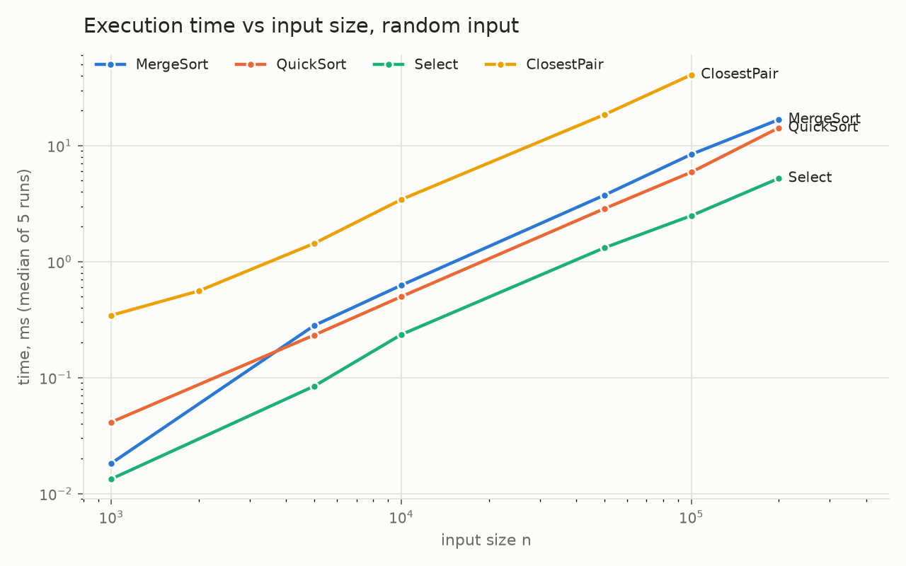
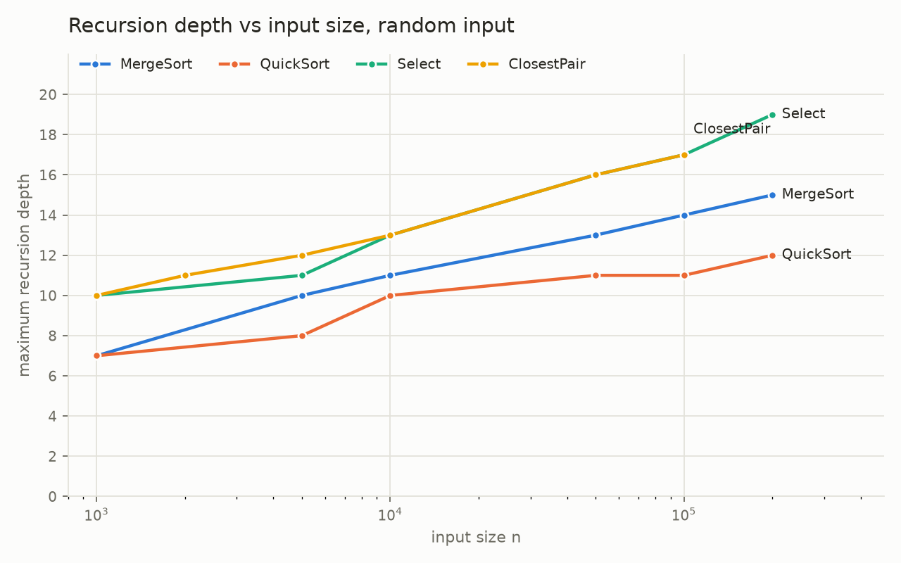
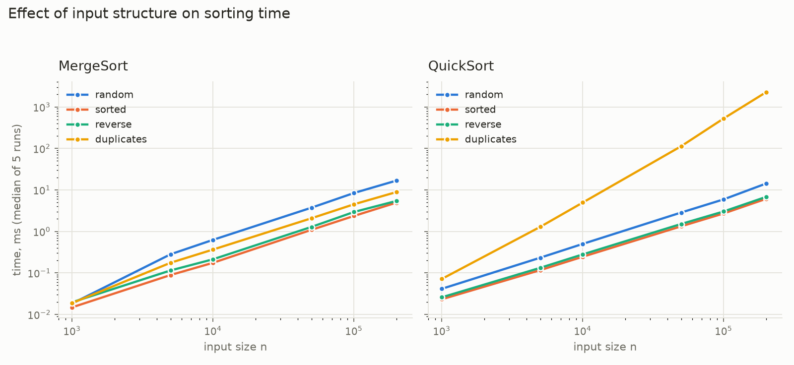
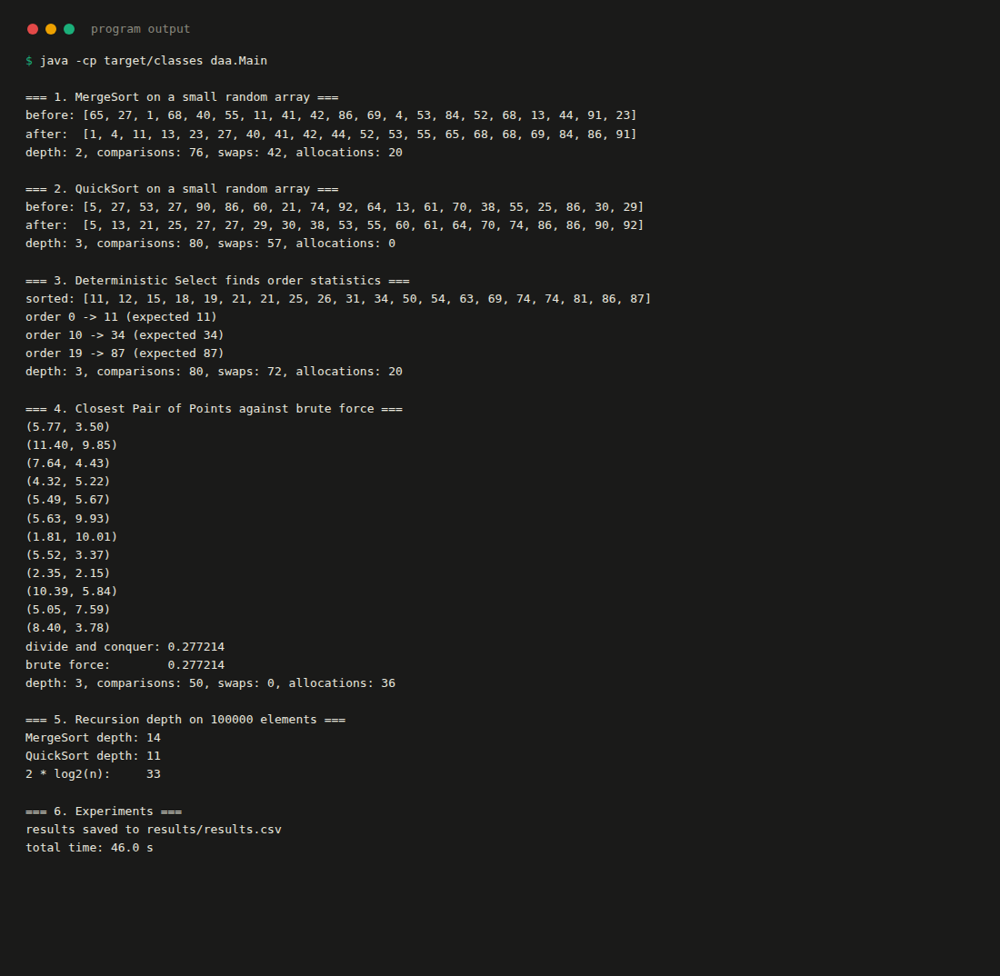
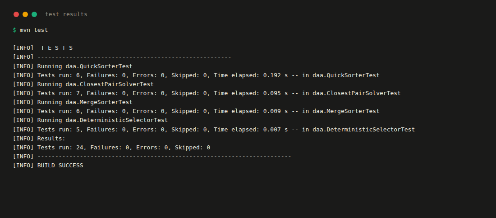

# Assignment 1: Divide-and-Conquer Algorithm Analysis

Anarov Daniyal, SE-2530, Astana IT University.

Repository: https://github.com/Collector119/asik-aitu-daa1

## A. Project Overview

The purpose of this assignment is to implement four classic divide-and-conquer
algorithms, measure how they actually behave on different inputs, and compare the
measurements with the running times predicted by recurrence analysis.

| Algorithm | Class | Expected complexity |
|---|---|---|
| MergeSort | `src/daa/MergeSorter.java` | Θ(n log n) |
| QuickSort | `src/daa/QuickSorter.java` | Θ(n log n) expected, O(n²) worst case |
| Deterministic Select | `src/daa/DeterministicSelector.java` | Θ(n) worst case |
| Closest Pair of Points | `src/daa/ClosestPairSolver.java` | Θ(n log n) |

Supporting classes: `Metrics.java` collects recursion depth, comparisons, swaps and
allocations; `Point.java` is an immutable point; `Experiment.java` runs the benchmarks
and writes `results/results.csv`; `Main.java` is the demonstration program.

### How to build and run

```
mvn test
mvn compile
java -cp target/classes daa.Main
```

`daa.Main` prints six demonstration blocks and then runs the full experiment suite,
which takes about 45 seconds and rewrites `results/results.csv`.

## B. Algorithm Analysis

### MergeSort

The array is split in half, both halves are sorted recursively, and the two sorted
halves are merged in a single linear pass. Two details matter for performance. The
auxiliary buffer is allocated once in `sort()` and passed down the recursion, so the
whole sort allocates exactly n extra elements instead of n per merge level. Ranges of
16 elements or fewer are handed to insertion sort, which removes the deepest and most
numerous recursive calls.

The recurrence is

```
T(n) = 2T(n/2) + Θ(n)
```

Master Theorem with a = 2, b = 2: n^(log_b a) = n^(log_2 2) = n, and f(n) = Θ(n). This
is case 2, f(n) = Θ(n^(log_b a)), so T(n) = Θ(n log n). Space is Θ(n) for the buffer
plus Θ(log n) stack frames. The cutoff does not change the asymptotics: it replaces the
bottom log₂(16) levels of the recursion tree with insertion sort on constant-size
ranges, which costs Θ(n) in total.

### QuickSort

A pivot is chosen uniformly at random and swapped to the end of the range, then the
range is partitioned in place around it. After partitioning, the implementation recurses
into the **smaller** side and continues the loop on the larger side, so the larger side
never adds a stack frame.

For a pivot that lands at position k the recurrence is

```
T(n) = T(k) + T(n - 1 - k) + Θ(n)
```

With a random pivot, k is uniform over the range, and averaging over all k gives the
expected running time Θ(n log n). The Master Theorem does not apply directly here, since
the two subproblems are not of equal size; the standard way to read this recurrence is
the Akra–Bazzi intuition that as long as the two parts are constant fractions of n on
average, the Θ(n) partitioning work is spread over Θ(log n) levels. If every pivot is
the worst possible one, the recurrence degenerates to T(n) = T(n-1) + Θ(n) = O(n²).

The recursion depth is bounded separately from the running time. Because only the
smaller side is recursed into, that side is at most n/2 elements, so the depth never
exceeds ⌊log₂ n⌋ + 1 regardless of how badly the pivots fall. Space is Θ(1) beyond the
stack.

### Deterministic Select (Median of Medians)

The range is cut into groups of 5, each group is sorted with insertion sort, and the
group medians are gathered at the front of the range. The median of those medians is
found by a recursive call and used as the partition pivot. After partitioning, only the
side that contains the requested order statistic is recursed into.

```
T(n) = T(n/5) + T(7n/10) + Θ(n)
```

The T(n/5) term is the recursive search for the median of medians; the T(7n/10) term is
the remaining side after partitioning. The 7n/10 bound comes from the structure of the
pivot: at least half of the n/5 group medians are ≤ the pivot, and each of those groups
contributes 3 elements that are ≤ the pivot, so at least 3n/10 elements are discarded on
every call and at most 7n/10 survive.

Akra–Bazzi intuition: the subproblem fractions sum to 1/5 + 7/10 = 9/10 < 1, so the work
per level shrinks geometrically and the Θ(n) top level dominates, giving T(n) = Θ(n).
The same result follows by substitution: assuming T(m) ≤ cm for m < n,

```
T(n) ≤ c(n/5) + c(7n/10) + an = 0.9cn + an ≤ cn   whenever c ≥ 10a
```

Space is Θ(n), because `select()` clones the input so the caller's array is not
modified, plus O(log n) stack frames.

### Closest Pair of Points

The points are sorted once by x. The recursion splits the range in half, solves both
halves, and takes the smaller of the two distances as the current best d. It then merges
the two halves into y-order — the same linear merge as in MergeSort — and scans the
strip of points within d of the dividing line. Because the strip is already in y-order,
the inner scan stops as soon as the y-difference reaches d, which bounds it by a constant
number of neighbours per point.

```
T(n) = 2T(n/2) + Θ(n)
```

Master Theorem case 2 again, so T(n) = Θ(n log n); the initial sort by x is another
Θ(n log n) and does not change the total. Keeping the y-order as a by-product of the
recursion is what keeps this at Θ(n log n): sorting the strip by y inside every call
would add a log factor and give Θ(n log² n). Space is Θ(n) for the sorted copy, the merge
buffer and the strip buffer.

## C. Experimental Results

All numbers were produced by `daa.Main` on one machine (Java 21, Ubuntu). Each entry is
the median of 5 measured runs after 10 warm-up runs, timed with `System.nanoTime()`. The
raw data is in `results/results.csv`.

### Execution time, ms

| Algorithm | Input | 1000 | 5000 | 10000 | 50000 | 100000 | 200000 |
|---|---|---|---|---|---|---|---|
| MergeSort | random | 0.02 | 0.28 | 0.63 | 3.73 | 8.41 | 16.74 |
| MergeSort | sorted | 0.01 | 0.09 | 0.18 | 1.09 | 2.36 | 4.93 |
| MergeSort | reverse sorted | 0.02 | 0.11 | 0.21 | 1.28 | 2.93 | 5.41 |
| MergeSort | duplicate heavy | 0.02 | 0.18 | 0.37 | 2.08 | 4.50 | 8.86 |
| QuickSort | random | 0.04 | 0.23 | 0.50 | 2.85 | 5.91 | 14.21 |
| QuickSort | sorted | 0.02 | 0.12 | 0.25 | 1.33 | 2.71 | 6.08 |
| QuickSort | reverse sorted | 0.03 | 0.13 | 0.28 | 1.51 | 3.02 | 6.78 |
| QuickSort | duplicate heavy | 0.07 | 1.29 | 4.95 | 112.94 | 525.07 | 2254.01 |
| DeterministicSelect | random | 0.01 | 0.08 | 0.24 | 1.31 | 2.49 | 5.22 |

Closest Pair runs on its own range of sizes, because the brute-force reference it is
checked against is only practical up to a few thousand points:

| n | 1000 | 2000 | 5000 | 10000 | 50000 | 100000 |
|---|---|---|---|---|---|---|
| ClosestPair | 0.34 | 0.56 | 1.43 | 3.43 | 18.45 | 40.76 |

### Maximum recursion depth, random input

| n | 1000 | 5000 | 10000 | 50000 | 100000 | 200000 |
|---|---|---|---|---|---|---|
| MergeSort | 7 | 10 | 11 | 13 | 14 | 15 |
| QuickSort | 7 | 8 | 10 | 11 | 11 | 12 |
| DeterministicSelect | 10 | 11 | 13 | 16 | 17 | 19 |

| n | 1000 | 2000 | 5000 | 10000 | 50000 | 100000 |
|---|---|---|---|---|---|---|
| ClosestPair | 10 | 11 | 12 | 13 | 16 | 17 |

### Comparisons at n = 200000

| Algorithm | Input | Comparisons | Comparisons / (n log₂ n) |
|---|---|---|---|
| MergeSort | random | 3,479,056 | 0.99 |
| MergeSort | sorted | 1,588,032 | 0.45 |
| MergeSort | reverse sorted | 2,517,632 | 0.72 |
| MergeSort | duplicate heavy | 3,314,675 | 0.94 |
| QuickSort | random | 4,229,649 | 1.20 |
| QuickSort | sorted | 4,219,227 | 1.20 |
| QuickSort | reverse sorted | 4,192,554 | 1.19 |
| QuickSort | duplicate heavy | 2,000,647,299 | 568.06 |

### Plots







## D. Discussion

**Do the results match theoretical complexity?**

For the three algorithms that are supposed to be Θ(n log n), the cleanest check is to
divide the measured time by n log₂ n and see whether the quotient settles down. Taking
the value at n = 1000 as 1.00, MergeSort gives 1.00, 2.49, 2.57, 2.60, 2.76, 2.59 and
QuickSort gives 1.00, 0.91, 0.90, 0.88, 0.86, 0.97. After the smallest input the ratio
is flat, which is what Θ(n log n) looks like. Closest Pair behaves the same way: 1.00,
0.74, 0.68, 0.75, 0.68, 0.71.

For Deterministic Select the corresponding check is time divided by n, and it also
flattens out: 1.00, 1.26, 1.76, 1.96, 1.86, 1.95. Linear growth is confirmed by the
comparison counts as well, which roughly double when n doubles (824k at n = 100000 and
1.64M at n = 200000).

The comparison counts are an even better match than the timings, because they are not
affected by the machine. MergeSort performs 0.99·n log₂ n comparisons on random input,
which is almost exactly the textbook prediction.

The one number that disagrees with the naive expectation is the smallest input. At
n = 1000 the whole array is 4 KB and fits in L1 cache, so the per-element cost is much
lower than at larger sizes; that is why the normalised ratio jumps from 1.00 to about
2.5 between n = 1000 and n = 5000 for MergeSort and then stops moving.

**How does input structure affect performance?**

MergeSort is stable across input types in the number of levels it performs — the depth
is 15 at n = 200000 for all four input types — but not in the work per level. On sorted
input it needs 1.59M comparisons instead of 3.48M, because each merge runs out of one
side early and the rest of the range is copied without any comparisons. That is a 3.4x
speedup in wall time and it comes entirely from the data, not from the algorithm.

QuickSort is almost insensitive to sorted and reverse-sorted input, which is exactly the
point of the random pivot: the classic quadratic blow-up on sorted arrays cannot happen
when the pivot does not depend on position. Duplicate-heavy input is a different story.
With only 10 distinct values, the Lomuto partition used here puts every element equal to
the pivot on one side, so the pivot ends at the boundary of a large block of equal keys
and the range shrinks by a small amount per call. The comparison count grows as a clean
quadratic: dividing it by n² gives 0.054, 0.051, 0.050, 0.050, 0.050, 0.050 across the
six sizes, and the time reaches 2.25 seconds at n = 200000. This is the O(n²) worst case
of QuickSort reached through duplicates rather than through adversarial ordering, and a
three-way partition would be the standard fix.

**Why does smaller-first recursion help QuickSort?**

Recursing into the smaller side and looping on the larger one does not change the number
of comparisons at all — it changes only how many stack frames are alive at once. The
smaller side is at most n/2 by definition, so each nested recursive call at least halves
the range and the depth is bounded by log₂ n. The measurements show this bound holding
with a lot of room to spare: 12 at n = 200000, against log₂(200000) ≈ 17.6.

The duplicate-heavy row makes the separation between depth and time very visible. There
the depth is 4 while the algorithm performs two billion comparisons: the stack stays
shallow because the iteration handles the long chain of large partitions, but the work
is still quadratic. Smaller-first recursion protects against stack overflow, not against
a bad pivot.

**Why does Median-of-Medians guarantee O(n)?**

Because it guarantees that a constant fraction of the input is thrown away on every
call. Out of the n/5 groups, at least half have a median that is ≤ the pivot, and in each
such group the median and the two elements below it are also ≤ the pivot. That is
3 · (n/10) = 3n/10 elements that cannot be on the far side, so the recursive call sees at
most 7n/10 elements. Combined with the n/5 cost of finding the pivot itself, the
subproblems sum to 9n/10, which is strictly less than n; the work per level therefore
decays geometrically and the total is dominated by the Θ(n) partitioning at the top.

A randomized pivot has the same expected behaviour but no guarantee, and that is the
price paid here: the measured times are linear, but the constant is large, because every
level sorts n/5 groups of five before it can even start partitioning.

**Why is divide-and-conquer Closest Pair faster than O(n²) for large inputs?**

Brute force examines every pair, which is n(n-1)/2 distance computations — 5 billion at
n = 100000. The divide-and-conquer version performed 1,679,077 distance comparisons at
the same size, roughly 3000 times fewer. The saving comes from the strip: once both
halves are solved, only points within d of the dividing line can possibly form a closer
pair, and because the strip is kept in y-order, each point in it is compared against a
constant number of neighbours. So the merge step costs Θ(n) instead of Θ(n²), and the
total follows the same recurrence as MergeSort.

At small n the picture is different. At n = 1000 the divide-and-conquer version takes
0.34 ms, and most of that is the initial `Arrays.sort` on an array of objects, not the
recursion — I measured the two parts separately and the sort was about two thirds of the
total. Brute force on 1000 points is only 500k distance computations on data that fits in
cache, so it is competitive at that size. The asymptotic advantage only pays off once n
is large enough for the quadratic term to dominate the sorting constant.

**What practical factors affect performance?**

JVM warm-up turned out to be the largest single effect in this assignment. The first
measurements of Closest Pair at n = 1000 came out at 0.85 ms; after raising the warm-up
to 10 runs the same measurement settled at 0.34 ms, a factor of 2.5 caused purely by JIT
compilation. Without enough warm-up, the small inputs are systematically overstated and
the curve looks sub-linear, which is impossible for a correct algorithm — that is how I
noticed the problem.

Cache behaviour explains the other deviation from the ideal curve: the n = 1000 arrays
fit in L1 and are disproportionately fast, so the normalised time per n log n is lower
there than at every larger size. Garbage collection matters for Closest Pair in
particular, because it works on `Point` objects rather than primitives, so every
comparison follows a pointer instead of reading a contiguous `int[]`. That is also why
Closest Pair is several times slower than MergeSort at the same n even though both are
Θ(n log n) with a linear merge.

Finally, measurement noise is real: single runs of the same configuration varied by more
than a factor of two on small inputs, which is why every number reported here is the
median of 5 runs rather than a single measurement.

## E. Reflection

The part of this assignment that taught me the most was not writing the algorithms but
measuring them. The four implementations were straightforward to get correct — the tests
compare MergeSort and QuickSort against `Arrays.sort`, Select against `Arrays.sort(a)[k]`
over 100 random cases, and Closest Pair against brute force up to 2000 points, and they
passed early. The measurements were much harder to trust. My first results showed Closest
Pair growing more slowly than n log n, which cannot happen, and tracking that down to JIT
warm-up rather than to a bug in the algorithm took longer than writing the algorithm. The
lesson I take from it is that a benchmark needs a sanity check of its own: dividing the
measured time by the predicted growth function and looking for a flat line catches
mistakes that reading the raw numbers does not.

The second thing I did not expect was how clearly the duplicate-heavy input separates two
ideas that I had been treating as one. Recursion depth and running time are not the same
quantity. My QuickSort recurses into the smaller partition first, which guarantees a
depth of O(log n), and the measurements confirm it — depth 4 on the duplicate-heavy
input. But that same input drives the running time to 2.25 seconds and two billion
comparisons, because the Lomuto partition cannot split a block of equal keys. Seeing a
shallow stack and a quadratic running time in the same row of the results table made the
distinction concrete in a way the lecture notes did not. The implementation detail I am
most satisfied with is the opposite case: reusing one auxiliary buffer across the whole
MergeSort, which the `allocatesAuxiliaryBufferOnlyOnce` test pins down by asserting that
a sort of 10000 elements allocates exactly 10000 extra elements and not one per level.

## F. Screenshots

Program output:



Test results:



The plots and the result tables are in section C above; the raw measurements they are
drawn from are in `results/results.csv`.
